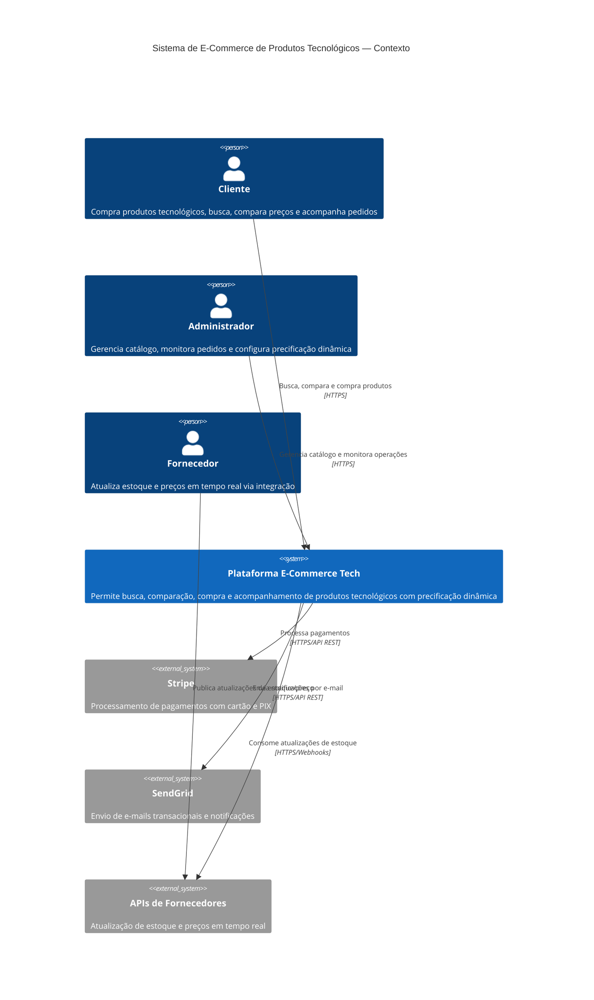
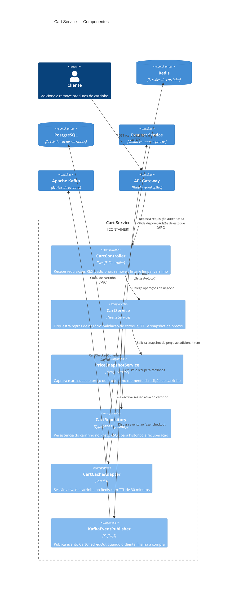
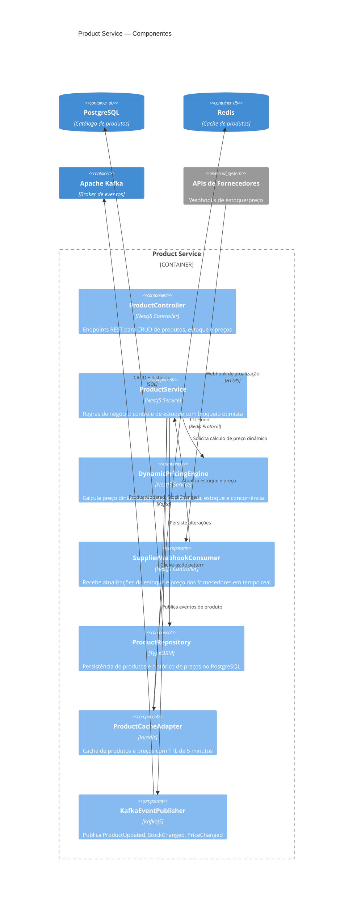
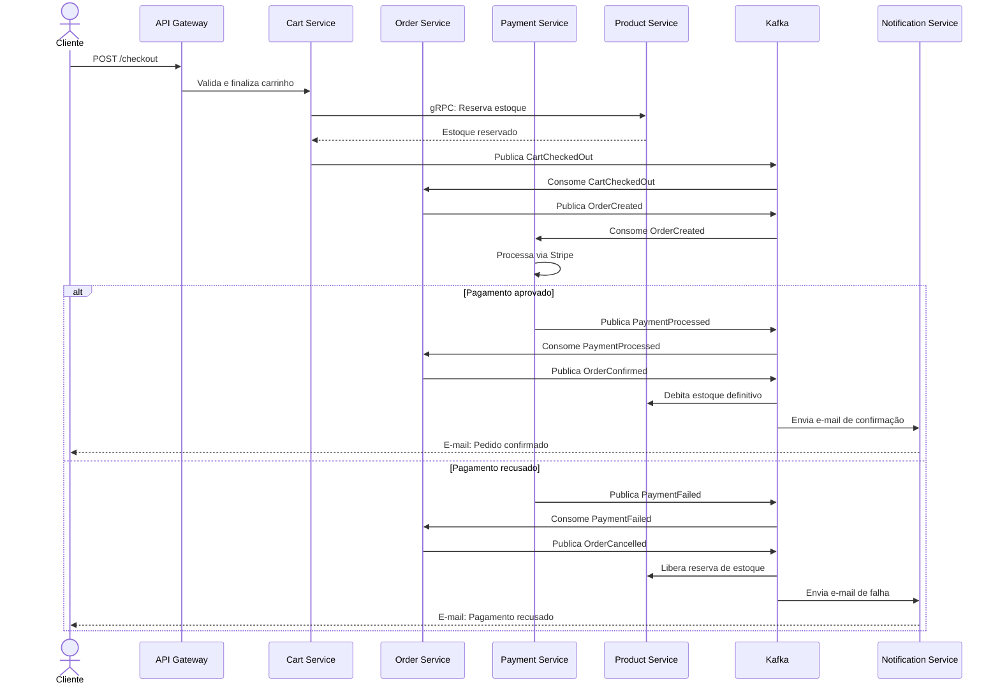

# Diagramas C4 — E-Commerce de Produtos Tecnológicos

> Cenário 3: Alta rotatividade de produtos, integração em tempo real com fornecedores, precificação dinâmica e recomendações personalizadas.

---

## Nível 1 — Diagrama de Contexto (System Context)

---

## Nível 2 — Diagrama de Containers

```mermaid
C4Container
    title Sistema de E-Commerce de Produtos Tecnológicos — Containers

    Person(customer, "Cliente", "Usa web ou app mobile")
    Person(admin, "Administrador", "Gerencia via painel admin")

    System_Boundary(ecommerce, "Plataforma E-Commerce Tech") {

        Container(spa, "Frontend Web / Mobile", "Next.js / React Native", "Interface do cliente para busca, comparação e compra")
        Container(gateway, "API Gateway", "Node.js / Kong", "Roteamento, autenticação JWT, rate limiting e correlação de requests")

        Container(user_svc, "User Service", "NestJS + PostgreSQL", "Cadastro, autenticação, emissão de JWT e perfil do usuário")
        Container(product_svc, "Product Service", "NestJS + PostgreSQL + Redis", "Catálogo, estoque, cache e precificação dinâmica")
        Container(search_svc, "Search Service", "NestJS + Elasticsearch", "Busca full-text, facetas, autocomplete e comparação de produtos")
        Container(cart_svc, "Cart Service", "NestJS + Redis + PostgreSQL", "Carrinho com TTL, snapshot de preços e persistência")
        Container(order_svc, "Order Service", "NestJS + PostgreSQL", "Ciclo de vida do pedido, Saga de orquestração e padrão Outbox")
        Container(payment_svc, "Payment Service", "NestJS + PostgreSQL", "Processamento de pagamentos, idempotência e webhooks Stripe")
        Container(notification_svc, "Notification Service", "NestJS", "Envio de e-mails e notificações via eventos Kafka")

        ContainerDb(kafka, "Apache Kafka", "Kafka 3.x", "Broker de eventos assíncronos entre microsserviços")
        ContainerDb(redis, "Redis", "Redis 7", "Cache distribuído e sessões de carrinho")
        ContainerDb(elasticsearch, "Elasticsearch", "ES 8.x", "Índice de produtos para busca e comparação")
    }

    System_Ext(stripe, "Stripe", "Gateway de pagamento")
    System_Ext(sendgrid, "SendGrid", "Provedor de e-mail")
    System_Ext(supplier_api, "APIs de Fornecedores", "Estoque e preços em tempo real")

    Rel(customer, spa, "Acessa via browser ou app", "HTTPS")
    Rel(admin, spa, "Gerencia via painel", "HTTPS")
    Rel(spa, gateway, "Todas as chamadas passam pelo gateway", "HTTPS/REST")

    Rel(gateway, user_svc, "Roteia autenticação e cadastro", "REST")
    Rel(gateway, product_svc, "Roteia consultas de produtos", "REST")
    Rel(gateway, search_svc, "Roteia buscas e comparações", "REST")
    Rel(gateway, cart_svc, "Roteia operações do carrinho", "REST")
    Rel(gateway, order_svc, "Roteia criação e consulta de pedidos", "REST")
    Rel(gateway, payment_svc, "Roteia pagamentos", "REST")

    Rel(product_svc, kafka, "Publica ProductUpdated, StockChanged, PriceChanged", "Kafka")
    Rel(cart_svc, kafka, "Publica CartCheckedOut", "Kafka")
    Rel(order_svc, kafka, "Publica OrderCreated, OrderConfirmed, OrderCancelled", "Kafka")
    Rel(payment_svc, kafka, "Publica PaymentProcessed, PaymentFailed", "Kafka")
    Rel(notification_svc, kafka, "Consome eventos para enviar notificações", "Kafka")
    Rel(search_svc, kafka, "Consome ProductUpdated para reindexar", "Kafka")

    Rel(product_svc, redis, "Cache de produtos e precificação", "Redis Protocol")
    Rel(cart_svc, redis, "Sessões de carrinho com TTL", "Redis Protocol")
    Rel(search_svc, elasticsearch, "Indexa e consulta produtos", "REST")
    Rel(payment_svc, stripe, "Processa pagamentos", "HTTPS")
    Rel(notification_svc, sendgrid, "Envia e-mails", "HTTPS")
    Rel(product_svc, supplier_api, "Consome atualizações de estoque/preço", "HTTPS/Webhooks")
```

---

## Nível 3 — Diagrama de Componentes (Cart Service)

---

## Nível 3 — Diagrama de Componentes (Product Service)

---

## Fluxo de Sequência — Checkout Completo

